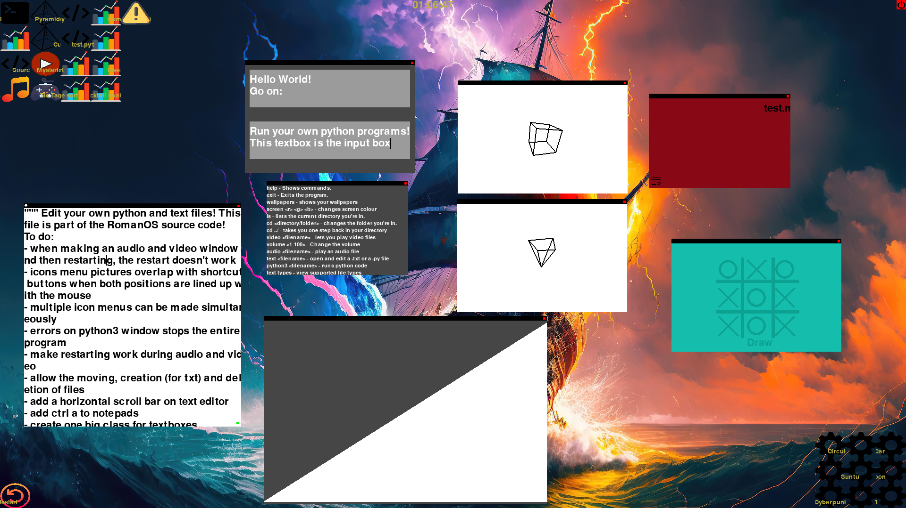

# RomanOS



## What you can do on RomanOS:
- Play audio files (and the audio from video files) on your hard drive (supports multiple file types)
- Play video files on your hard drive
- View image files on your hard drive
- Navigate your directories
- Edit and create 30 different text file types (.css, .py, .html, .js, etc...)
- Change the wallpaper to one of the preinstalled ones (or a custom one of your own)
- Change the wallpaper to an RGB colour
- Edit the source code within RomanOS itself
- Run python3 code using the 'python3' command
- Run various sorting algorithms (bubble sort, merge sort, comb sort, insertion sort, cocktail shaker sort, bogo sort)
- Play games (such as Tic Tac Toe against an AI)
- Change the volume on linux and windows (theoretically mac too, but untested)
- Can be run on a command line interface (Tested with ubuntu console)
- Explore some cool rotating 3D shapes 
- Automatically run commands on startup 

## What is RomanOS?

RomanOS is a python desktop environment.

## Installation

Download the zip file of the code and then run:
pip install -r requirements.txt

Afterwards, just run wrapper.py!

## Extra stuff:
ffmpeg is used to play audio for this program. Can be annoying to get on windows.
These commands might work:
```winget install Gyan.FFmpeg```
```pip install ffmpeg```
